# Anomaly detection

This notebook focuses on detection of bearing failure from [a dataset of measures made publicly available by the NASA](http://data-acoustics.com/measurements/bearing-faults/bearing-4/). The dataset was used in [a blog post by Vegard Flovik](https://towardsdatascience.com/how-to-use-machine-learning-for-anomaly-detection-and-condition-monitoring-6742f82900d7). In this notebook I will try to reproduce, explain and extend his methodology.

Data consists of individual files that are 1-second vibration signal snapshots recorded at specific intervals. Each file consists of 20,480 points with the sampling rate set at 20 kHz. The file name indicates when the data was collected. Each record (row) in the data file is a data point. The used data set (on 3 available) contains 984 files.

Three appraoches will be developped for failure detection :
 - First I'll try PCA and Mahalanobis distance
 - Secondly I'll try using an autoencoder Mean Squared Error
 - Finally I'll try a single class SVM
 
All these approaches try to learn the shape of normal data and when applied to data near failure they will find the deviation from normal data.

## Get Data


```python
import numpy as np
import pandas as pd
from matplotlib import pyplot as plt
import seaborn as sns
from os import listdir, getcwd
from os.path import join
```


```python
# Get second dataset
files = listdir(join(getcwd(), '2nd_test', '2nd_test'))
files.sort()
```


```python
# Loading for Flovik's method
merged_data = pd.DataFrame()
for filename in files:
    dataset=pd.read_csv(join(getcwd(), '2nd_test', '2nd_test',
                             filename), sep='\t')
    dataset_mean_abs = np.array(dataset.abs().mean())
    dataset_mean_abs = pd.DataFrame(dataset_mean_abs.reshape(1,4))
    dataset_mean_abs.index = [filename]
    merged_data = merged_data.append(dataset_mean_abs)

merged_data.columns = ['Bearing 1','Bearing 2','Bearing 3','Bearing 4']
merged_data.index = pd.to_datetime(merged_data.index, format='%Y.%m.%d.%H.%M.%S')

merged_data = merged_data.sort_index()
merged_data.to_csv('merged_dataset_BearingTest_2.csv')
```

Flovik turns data into their mean absolute value, leading to a
first compression step. This steps can be considered from a signal processing view : by computing the mean absolute acceleration of each bearing at each measure point we compute the mean of signal over a window of 1 seconde. Thus we remove noise from the data.


```python
dataset_train = merged_data['2004-02-12 11:02:39':'2004-02-13 23:52:39']
dataset_test = merged_data['2004-02-13 23:52:39':]

dataset_train.plot(figsize = (12,6))
```


    <matplotlib.axes._subplots.AxesSubplot at 0x201362e16a0>


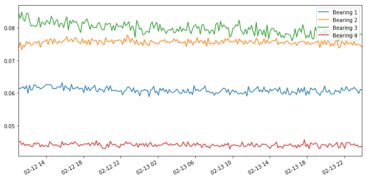


## Preparing dataset


```python
import re

pattern_1 = "2004.02.12.*"
pattern_2 = "2004.02.13.*"
day_one = []
day_two = []
training_set = []
for f in files :
    d1 = re.findall(pattern_1, f) 
    d2 = re.findall(pattern_2, f) 
    if(len(d1) > 0) :
        day_one.append(d1[0])
        training_set.append(d1[0])
    if(len(d2) > 0) :
        day_two.append(d2[0])
        training_set.append(d2[0])
test_set = files[len(training_set):]
```

#### Scaling for Flovik approach


```python
from sklearn import preprocessing

scaler = preprocessing.MinMaxScaler()

X_train = pd.DataFrame(scaler.fit_transform(dataset_train), 
                              columns=dataset_train.columns, 
                              index=dataset_train.index)
X_train.plot(figsize = (12,6))
# Random shuffle training data
X_train.sample(frac=1)

X_test = pd.DataFrame(scaler.transform(dataset_test), 
                             columns=dataset_test.columns, 
                             index=dataset_test.index)
```


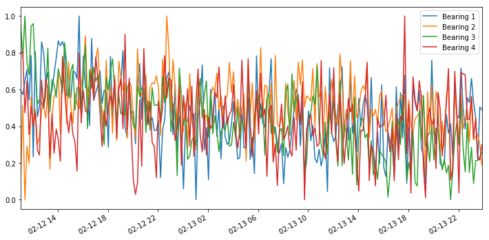


Using the scaler allows to make the signal from the 4 bearings comparable. They all lie between 0 and 1. Thus when running PCA no bearing triggers stronger value than others.

## PCA + Mahalanobis

### My own method


```python
from sklearn.decomposition import PCA
from scipy.spatial.distance import mahalanobis
from numpy import cov, array, append, ndarray, apply_along_axis, mean
from scipy.linalg import inv


# Compute PCs coordinate for initial values
pca = PCA(n_components = 3, random_state = 42, 
            svd_solver = 'arpack')
ref_pca = pca.fit_transform(pd.read_csv(join(getcwd(), '2nd_test', '2nd_test', training_set[0]), sep = "\t",
                         names = ['Bearing1', "Bearing2", "Bearing3", "Bearing4"]))

# plot explained variance 
sns.barplot(y = pca.explained_variance_ratio_, x = [1,2,3])
plt.savefig("PCA_explained_variance.png")
```


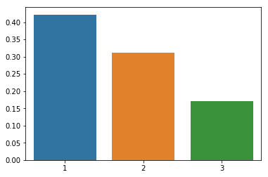


```python
# Get parameters of reference data
def get_param(pca) :
    """
    This function computes columns means and covariance matrix of a table.
    Parameters :
    -  pca : a table, meant to result from scikitlearn PCA function
    Return :
    A dictionnary with means in "means", and inverse covariance in "inverse_covariance"
    """
    means =apply_along_axis(mean, axis = 0, arr = pca)
    inv_cov = inv(cov(pca.transpose()))
    return({"means" : means, "inverse_covariance" : inv_cov})
  
    
ref_param = get_param(ref_pca)
```


```python
def write_reference(ref, name = "reference") :
    """
    This function write reference paramaters into separate files : one for means,
    one for inverse covariance.
    Parameters :
     - ref : a dictionnary with means in "means", and inverse covariance matrix
     in "inverse_covariance"
    """
    ref["means"].tofile(name + "_means.csv", sep = ",")
    ref["inverse_covariance"].tofile(name + "_cov.csv", sep = ",")

def read_reference(means_file, inverse_cov_file) :
    """
    Read means and inverse covariance matrix from files.
    Parameters :
     - means_file : file with the array of means
     - inverse_cov_file : file containing the array of the covariance matrix
    Return :
    A dictionnary with means in "means", and inverse covariance in "inverse_covariance" 
    """
    means = np.fromfile(means_file, sep=",")
    inv_cov = np.fromfile(inverse_cov_file, sep=",")
    invcov = np.reshape(inv_cov, (len(means), len(means)))
    ref = {"means" : means,
          "inverse_covariance": inv_cov}
    return(ref)  

write_reference(ref_param)
```


```python
def PCA_Mahalanobis(data, n_components, ref) :
    """
    Computes the mahalanobis distance of data points from a reference after dimensionality
    reduction by PCA
    Parameters :
     - data : the data with dimensions in columns
     - n_components : number of component to keep
     - ref : a dictionnary with means in "means", and inverse covariance in "inverse_covariance" 
    Returns :
     An array with the mean mahalanobis distance for the data. 
    """
    
    # define maximum number of PCs
    if n_components >= data.shape[1] :
         n_components = data.shape[1] - 1
            
    pca = PCA(n_components = n_components, random_state = 42, 
              svd_solver = 'arpack')
    new_coord = pca.fit_transform(data)
    dist_list = []
    for row in range(data.shape[1] + 1) :
        dist = mahalanobis(ref["means"], 
                           new_coord[row],
                           ref["inverse_covariance"])
        dist_list.append(dist)
    return(mean(dist_list))

mahal_dist = []
for f in training_set[1:] :
    table = pd.read_csv(join(getcwd(), '2nd_test', '2nd_test', f), sep = "\t",
                         names = ['Bearing1', "Bearing2", "Bearing3", "Bearing4"])
    m_dist = PCA_Mahalanobis(table, 3, ref_param)
    mahal_dist.append(m_dist)
mahal_dist = array(mahal_dist)
```


```python
# Plot reference Mahalanobis distances distribution
sns.distplot(mahal_dist)
plt.savefig("Mahalanobis_distribution.png")
```

    C:\Users\NOTEBOOK\Miniconda3\lib\site-packages\scipy\stats\stats.py:1713: FutureWarning: Using a non-tuple sequence for multidimensional indexing is deprecated; use `arr[tuple(seq)]` instead of `arr[seq]`. In the future this will be interpreted as an array index, `arr[np.array(seq)]`, which will result either in an error or a different result.
      return np.add.reduce(sorted[indexer] * weights, axis=axis) / sumval
    


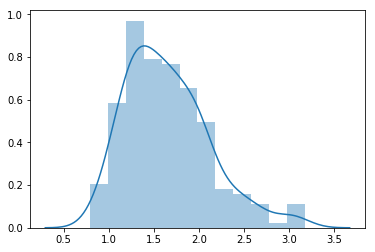


```python
# Compute distances on test set
distances = []
for f in test_set :
    table = pd.read_csv(join(getcwd(), '2nd_test', '2nd_test', f), sep = "\t",
                         names = ['Bearing1', "Bearing2", "Bearing3", "Bearing4"])
    m_dist = PCA_Mahalanobis(table, 3, ref_param)
    distances.append(m_dist)
```


```python
# Plot distances over time
dates = [file_name.replace(".", "/", 2) for file_name in test_set]
dates = [file_name.replace(".", " ", 1) for file_name in dates]
dates = [file_name.replace(".", ":") for file_name in dates]

sns.lineplot(y = distances, x =  pd.to_datetime(pd.Series(dates), yearfirst = True))
plt.axhline(y = 3.5, color='r', linestyle='--')
plt.savefig("Mahalanobis_threshold.png")
```


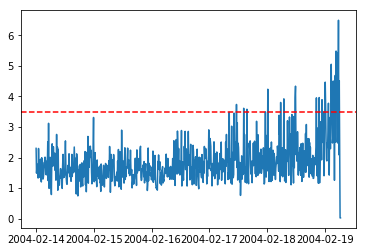


```python
# Save results
res = pd.DataFrame({
    "Date": dates,
    "Mean_Mahalanobis": distances,
    "Failure": [distance > 3.5 for distance in distances]
})
res.to_csv('Mahalanobis_distance.csv')
res[495:505]
```


<div>
<style scoped>
    .dataframe tbody tr th:only-of-type {
        vertical-align: middle;
    }

    .dataframe tbody tr th {
        vertical-align: top;
    }

    .dataframe thead th {
        text-align: right;
    }
</style>
<table border="1" class="dataframe">
  <thead>
    <tr style="text-align: right;">
      <th></th>
      <th>Date</th>
      <th>Mean_Mahalanobis</th>
      <th>Failure</th>
    </tr>
  </thead>
  <tbody>
    <tr>
      <th>495</th>
      <td>2004/02/17 10:32:39</td>
      <td>1.908871</td>
      <td>False</td>
    </tr>
    <tr>
      <th>496</th>
      <td>2004/02/17 10:42:39</td>
      <td>2.010467</td>
      <td>False</td>
    </tr>
    <tr>
      <th>497</th>
      <td>2004/02/17 10:52:39</td>
      <td>2.503905</td>
      <td>False</td>
    </tr>
    <tr>
      <th>498</th>
      <td>2004/02/17 11:02:39</td>
      <td>2.212107</td>
      <td>False</td>
    </tr>
    <tr>
      <th>499</th>
      <td>2004/02/17 11:12:39</td>
      <td>3.739426</td>
      <td>True</td>
    </tr>
    <tr>
      <th>500</th>
      <td>2004/02/17 11:22:39</td>
      <td>1.674481</td>
      <td>False</td>
    </tr>
    <tr>
      <th>501</th>
      <td>2004/02/17 11:32:39</td>
      <td>3.137308</td>
      <td>False</td>
    </tr>
    <tr>
      <th>502</th>
      <td>2004/02/17 11:42:39</td>
      <td>1.263233</td>
      <td>False</td>
    </tr>
    <tr>
      <th>503</th>
      <td>2004/02/17 11:52:39</td>
      <td>2.470626</td>
      <td>False</td>
    </tr>
    <tr>
      <th>504</th>
      <td>2004/02/17 12:02:39</td>
      <td>2.333666</td>
      <td>False</td>
    </tr>
  </tbody>
</table>
</div>


### Vegard Flovik's Method


```python
# compute PCA
pca = PCA(n_components=2, svd_solver= 'full')

X_train_PCA = pca.fit_transform(X_train)
X_train_PCA = pd.DataFrame(X_train_PCA)
X_train_PCA.index = X_train.index

X_test_PCA = pca.transform(X_test)
X_test_PCA = pd.DataFrame(X_test_PCA)
X_test_PCA.index = X_test.index

data_train = np.array(X_train_PCA.values)
data_test = np.array(X_test_PCA.values)
```


```python
# Get parameters
params = get_param(data_train)

write_reference(params, name = "Flovik")
```


```python
def Mahalanobis_distance(data, ref) :
    """
    Computes the mahalanobis distance of data points with dimensionality reduced by PCA
    from a reference
    Parameters :
     - data : the data with dimensions in columns
     - ref : a dictionnary with means in "means", and inverse covariance in "inverse_covariance" 
    Returns :
     An array with the mean mahalanobis distance for the data. 
    """
    dist_list = []
    for row in range(data.shape[0]) :
        dist = mahalanobis(ref["means"], 
                           data[row],
                           ref["inverse_covariance"])
        dist_list.append(dist)
    return(dist_list)

distances = Mahalanobis_distance(data_train, params)
```


```python
# Plot reference Mahalanobis distances distribution
sns.distplot(distances)
plt.savefig("Flovik_Mahalanobis_distribution.png")
```

    C:\Users\NOTEBOOK\Miniconda3\lib\site-packages\scipy\stats\stats.py:1713: FutureWarning: Using a non-tuple sequence for multidimensional indexing is deprecated; use `arr[tuple(seq)]` instead of `arr[seq]`. In the future this will be interpreted as an array index, `arr[np.array(seq)]`, which will result either in an error or a different result.
      return np.add.reduce(sorted[indexer] * weights, axis=axis) / sumval
    


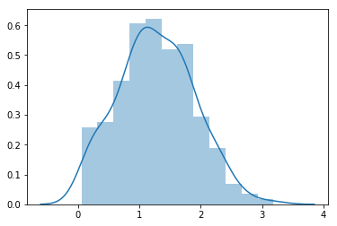


```python
def get_threshold(distances, n_sd = 3) :
    """
    Computes trheshold value using mean value + a given number of standard deviations
    Parameters :
     - distances : array of float
     - n_sd : number of standard deviations
    """
    threshold = np.mean(distances) + n_sd * np.std(distances)
    return(threshold)

limit_value = get_threshold(distances, 4)
```


```python
distances = Mahalanobis_distance(data_test, params)

sns.lineplot(y = np.log(np.array(distances) + 1), x =  X_test.index)
plt.axhline(y = np.log(limit_value + 1), color='r', linestyle='--')
plt.savefig("Flovik_Mahalanobis_threshold.png")
```


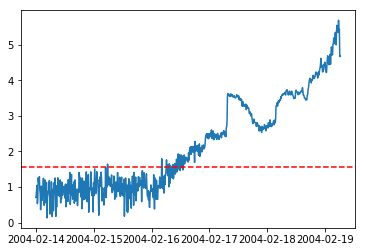


```python
res = pd.DataFrame({
    "Date": X_test.index,
    "Mean_Mahalanobis": distances,
    "Failure": [distance > limit_value for distance in distances]
})
res.to_csv('Flovik_Mahalanobis_distance.csv')
res[310:320]
```


<div>
<style scoped>
    .dataframe tbody tr th:only-of-type {
        vertical-align: middle;
    }

    .dataframe tbody tr th {
        vertical-align: top;
    }

    .dataframe thead th {
        text-align: right;
    }
</style>
<table border="1" class="dataframe">
  <thead>
    <tr style="text-align: right;">
      <th></th>
      <th>Date</th>
      <th>Mean_Mahalanobis</th>
      <th>Failure</th>
    </tr>
  </thead>
  <tbody>
    <tr>
      <th>310</th>
      <td>2004-02-16 03:32:39</td>
      <td>1.617560</td>
      <td>False</td>
    </tr>
    <tr>
      <th>311</th>
      <td>2004-02-16 03:42:39</td>
      <td>1.794457</td>
      <td>False</td>
    </tr>
    <tr>
      <th>312</th>
      <td>2004-02-16 03:52:39</td>
      <td>1.812086</td>
      <td>False</td>
    </tr>
    <tr>
      <th>313</th>
      <td>2004-02-16 04:02:39</td>
      <td>1.712335</td>
      <td>False</td>
    </tr>
    <tr>
      <th>314</th>
      <td>2004-02-16 04:12:39</td>
      <td>5.031201</td>
      <td>True</td>
    </tr>
    <tr>
      <th>315</th>
      <td>2004-02-16 04:22:39</td>
      <td>3.681988</td>
      <td>False</td>
    </tr>
    <tr>
      <th>316</th>
      <td>2004-02-16 04:32:39</td>
      <td>1.598158</td>
      <td>False</td>
    </tr>
    <tr>
      <th>317</th>
      <td>2004-02-16 04:42:39</td>
      <td>1.729748</td>
      <td>False</td>
    </tr>
    <tr>
      <th>318</th>
      <td>2004-02-16 04:52:39</td>
      <td>1.998568</td>
      <td>False</td>
    </tr>
    <tr>
      <th>319</th>
      <td>2004-02-16 05:02:39</td>
      <td>2.614594</td>
      <td>False</td>
    </tr>
  </tbody>
</table>
</div>


Flovik's method allow for earlier detection and cleaner results. This is due to :
 - 1 : Considering only acceleration value independant of the direction
 - 2 : Considering mean value for each time-point thus leading to cleaner signal
 - 3 : Computation of reference over the whole training set

## Autoencoder


```python
from numpy.random import seed
from tensorflow import set_random_seed

from keras.layers.core import Dense 
from keras.models import Model, Sequential, load_model
```

    Using TensorFlow backend.
    

This time we have no choice but to use the full dataset for training. Compaction with sliding mean is essential to allow computation.

### My own model


```python
seed(10)
set_random_seed(10)

# Train model for 100 epochs, batch size of 10: 
NUM_EPOCHS=100 # number of iteration over dataset
BATCH_SIZE=10 # subset of data set to use to update model, 
#               all btches are considered during each epoch

# Build model
model = Sequential()

# Model is 4 -> 3 -> 2 -> 3 -> 4
model.add(Dense(3, input_dim=4, activation = 'relu', kernel_initializer='glorot_uniform'))
model.add(Dense(2, activation = 'elu', kernel_initializer='glorot_uniform'))
model.add(Dense(3, activation = 'elu', kernel_initializer='glorot_uniform'))
model.add(Dense(4, activation = 'elu', kernel_initializer='glorot_uniform'))

model.compile(optimizer='adam',
              loss='mean_squared_error')
```

We use the elu (Exponential linear unit) activation function, which returns x if x > 0 and
exp((x)-1) if x < 0). Here all values are positives so the activation functions is set to return x. No difference was observed based on variation of the initialization of weights. This may mean that model training is complete after 100 iterations, and thus results are stable.


```python
# Fit model
history=model.fit(np.array(X_train),np.array(X_train),
                  batch_size=BATCH_SIZE, 
                  epochs=NUM_EPOCHS,
                  validation_split=0.05,
                  verbose = 1) # verbose is set to True in order to get history of loss function
```

    Train on 210 samples, validate on 12 samples
    Epoch 1/100
    210/210 [==============================] - 0s 2ms/step - loss: 0.2721 - val_loss: 0.2192
    Epoch 2/100
    210/210 [==============================] - 0s 190us/step - loss: 0.2200 - val_loss: 0.1832
    Epoch 3/100
    210/210 [==============================] - 0s 143us/step - loss: 0.1842 - val_loss: 0.1551
    Epoch 4/100
    210/210 [==============================] - 0s 237us/step - loss: 0.1554 - val_loss: 0.1301
    Epoch 5/100
    210/210 [==============================] - 0s 238us/step - loss: 0.1297 - val_loss: 0.1064
    Epoch 6/100
    210/210 [==============================] - 0s 238us/step - loss: 0.1071 - val_loss: 0.0855
    Epoch 7/100
    210/210 [==============================] - 0s 306us/step - loss: 0.0874 - val_loss: 0.0683
    Epoch 8/100
    210/210 [==============================] - 0s 218us/step - loss: 0.0716 - val_loss: 0.0550
    Epoch 9/100
    210/210 [==============================] - 0s 191us/step - loss: 0.0593 - val_loss: 0.0457
    Epoch 10/100
    210/210 [==============================] - 0s 238us/step - loss: 0.0505 - val_loss: 0.0385
    Epoch 11/100
    210/210 [==============================] - 0s 191us/step - loss: 0.0438 - val_loss: 0.0334
    Epoch 12/100
    210/210 [==============================] - 0s 236us/step - loss: 0.0390 - val_loss: 0.0300
    Epoch 13/100
    210/210 [==============================] - 0s 240us/step - loss: 0.0355 - val_loss: 0.0273
    Epoch 14/100
    210/210 [==============================] - 0s 238us/step - loss: 0.0330 - val_loss: 0.0253
    Epoch 15/100
    210/210 [==============================] - 0s 141us/step - loss: 0.0310 - val_loss: 0.0236
    Epoch 16/100
    210/210 [==============================] - 0s 237us/step - loss: 0.0296 - val_loss: 0.0225
    Epoch 17/100
    210/210 [==============================] - 0s 192us/step - loss: 0.0285 - val_loss: 0.0221
    Epoch 18/100
    210/210 [==============================] - 0s 141us/step - loss: 0.0277 - val_loss: 0.0211
    Epoch 19/100
    210/210 [==============================] - 0s 288us/step - loss: 0.0271 - val_loss: 0.0204
    Epoch 20/100
    210/210 [==============================] - 0s 236us/step - loss: 0.0266 - val_loss: 0.0201
    Epoch 21/100
    210/210 [==============================] - 0s 239us/step - loss: 0.0262 - val_loss: 0.0198
    Epoch 22/100
    210/210 [==============================] - 0s 236us/step - loss: 0.0259 - val_loss: 0.0194
    Epoch 23/100
    210/210 [==============================] - 0s 241us/step - loss: 0.0255 - val_loss: 0.0189
    Epoch 24/100
    210/210 [==============================] - 0s 188us/step - loss: 0.0253 - val_loss: 0.0188
    Epoch 25/100
    210/210 [==============================] - 0s 243us/step - loss: 0.0250 - val_loss: 0.0184
    Epoch 26/100
    210/210 [==============================] - 0s 233us/step - loss: 0.0247 - val_loss: 0.0180
    Epoch 27/100
    210/210 [==============================] - 0s 195us/step - loss: 0.0245 - val_loss: 0.0177
    Epoch 28/100
    210/210 [==============================] - 0s 233us/step - loss: 0.0243 - val_loss: 0.0173
    Epoch 29/100
    210/210 [==============================] - 0s 190us/step - loss: 0.0241 - val_loss: 0.0170
    Epoch 30/100
    210/210 [==============================] - 0s 238us/step - loss: 0.0239 - val_loss: 0.0170
    Epoch 31/100
    210/210 [==============================] - 0s 190us/step - loss: 0.0236 - val_loss: 0.0165
    Epoch 32/100
    210/210 [==============================] - 0s 190us/step - loss: 0.0234 - val_loss: 0.0164
    Epoch 33/100
    210/210 [==============================] - 0s 209us/step - loss: 0.0233 - val_loss: 0.0161
    Epoch 34/100
    210/210 [==============================] - 0s 240us/step - loss: 0.0232 - val_loss: 0.0158
    Epoch 35/100
    210/210 [==============================] - 0s 189us/step - loss: 0.0229 - val_loss: 0.0156
    Epoch 36/100
    210/210 [==============================] - 0s 239us/step - loss: 0.0228 - val_loss: 0.0154
    Epoch 37/100
    210/210 [==============================] - 0s 333us/step - loss: 0.0226 - val_loss: 0.0152
    Epoch 38/100
    210/210 [==============================] - 0s 190us/step - loss: 0.0225 - val_loss: 0.0152
    Epoch 39/100
    210/210 [==============================] - 0s 239us/step - loss: 0.0223 - val_loss: 0.0149
    Epoch 40/100
    210/210 [==============================] - 0s 237us/step - loss: 0.0222 - val_loss: 0.0147
    Epoch 41/100
    210/210 [==============================] - 0s 191us/step - loss: 0.0221 - val_loss: 0.0145
    Epoch 42/100
    210/210 [==============================] - 0s 239us/step - loss: 0.0220 - val_loss: 0.0145
    Epoch 43/100
    210/210 [==============================] - 0s 238us/step - loss: 0.0219 - val_loss: 0.0145
    Epoch 44/100
    210/210 [==============================] - 0s 207us/step - loss: 0.0217 - val_loss: 0.0146
    Epoch 45/100
    210/210 [==============================] - 0s 271us/step - loss: 0.0216 - val_loss: 0.0142
    Epoch 46/100
    210/210 [==============================] - 0s 189us/step - loss: 0.0216 - val_loss: 0.0145
    Epoch 47/100
    210/210 [==============================] - 0s 237us/step - loss: 0.0214 - val_loss: 0.0143
    Epoch 48/100
    210/210 [==============================] - 0s 287us/step - loss: 0.0213 - val_loss: 0.0143
    Epoch 49/100
    210/210 [==============================] - 0s 237us/step - loss: 0.0213 - val_loss: 0.0143
    Epoch 50/100
    210/210 [==============================] - 0s 238us/step - loss: 0.0212 - val_loss: 0.0144
    Epoch 51/100
    210/210 [==============================] - 0s 253us/step - loss: 0.0211 - val_loss: 0.0142
    Epoch 52/100
    210/210 [==============================] - 0s 225us/step - loss: 0.0210 - val_loss: 0.0142
    Epoch 53/100
    210/210 [==============================] - 0s 206us/step - loss: 0.0209 - val_loss: 0.0144
    Epoch 54/100
    210/210 [==============================] - 0s 245us/step - loss: 0.0208 - val_loss: 0.0144
    Epoch 55/100
    210/210 [==============================] - 0s 238us/step - loss: 0.0208 - val_loss: 0.0143
    Epoch 56/100
    210/210 [==============================] - 0s 190us/step - loss: 0.0207 - val_loss: 0.0141
    Epoch 57/100
    210/210 [==============================] - 0s 209us/step - loss: 0.0206 - val_loss: 0.0143
    Epoch 58/100
    210/210 [==============================] - 0s 124us/step - loss: 0.0206 - val_loss: 0.0144
    Epoch 59/100
    210/210 [==============================] - 0s 190us/step - loss: 0.0205 - val_loss: 0.0144
    Epoch 60/100
    210/210 [==============================] - 0s 188us/step - loss: 0.0204 - val_loss: 0.0144
    Epoch 61/100
    210/210 [==============================] - 0s 194us/step - loss: 0.0203 - val_loss: 0.0144
    Epoch 62/100
    210/210 [==============================] - 0s 190us/step - loss: 0.0203 - val_loss: 0.0144
    Epoch 63/100
    210/210 [==============================] - 0s 191us/step - loss: 0.0202 - val_loss: 0.0144
    Epoch 64/100
    210/210 [==============================] - 0s 190us/step - loss: 0.0202 - val_loss: 0.0145
    Epoch 65/100
    210/210 [==============================] - 0s 192us/step - loss: 0.0201 - val_loss: 0.0145
    Epoch 66/100
    210/210 [==============================] - 0s 238us/step - loss: 0.0201 - val_loss: 0.0146
    Epoch 67/100
    210/210 [==============================] - 0s 304us/step - loss: 0.0200 - val_loss: 0.0147
    Epoch 68/100
    210/210 [==============================] - 0s 173us/step - loss: 0.0199 - val_loss: 0.0147
    Epoch 69/100
    210/210 [==============================] - 0s 184us/step - loss: 0.0199 - val_loss: 0.0143
    Epoch 70/100
    210/210 [==============================] - 0s 244us/step - loss: 0.0198 - val_loss: 0.0148
    Epoch 71/100
    210/210 [==============================] - 0s 190us/step - loss: 0.0198 - val_loss: 0.0147
    Epoch 72/100
    210/210 [==============================] - 0s 190us/step - loss: 0.0197 - val_loss: 0.0147
    Epoch 73/100
    210/210 [==============================] - 0s 191us/step - loss: 0.0196 - val_loss: 0.0148
    Epoch 74/100
    210/210 [==============================] - 0s 237us/step - loss: 0.0196 - val_loss: 0.0147
    Epoch 75/100
    210/210 [==============================] - 0s 190us/step - loss: 0.0196 - val_loss: 0.0145
    Epoch 76/100
    210/210 [==============================] - 0s 192us/step - loss: 0.0195 - val_loss: 0.0147
    Epoch 77/100
    210/210 [==============================] - 0s 189us/step - loss: 0.0195 - val_loss: 0.0149
    Epoch 78/100
    210/210 [==============================] - 0s 238us/step - loss: 0.0194 - val_loss: 0.0147
    Epoch 79/100
    210/210 [==============================] - 0s 143us/step - loss: 0.0194 - val_loss: 0.0148
    Epoch 80/100
    210/210 [==============================] - 0s 237us/step - loss: 0.0193 - val_loss: 0.0152
    Epoch 81/100
    210/210 [==============================] - 0s 190us/step - loss: 0.0192 - val_loss: 0.0151
    Epoch 82/100
    210/210 [==============================] - 0s 192us/step - loss: 0.0192 - val_loss: 0.0151
    Epoch 83/100
    210/210 [==============================] - 0s 192us/step - loss: 0.0192 - val_loss: 0.0150
    Epoch 84/100
    210/210 [==============================] - 0s 189us/step - loss: 0.0191 - val_loss: 0.0151
    Epoch 85/100
    210/210 [==============================] - 0s 191us/step - loss: 0.0191 - val_loss: 0.0150
    Epoch 86/100
    210/210 [==============================] - 0s 191us/step - loss: 0.0190 - val_loss: 0.0153
    Epoch 87/100
    210/210 [==============================] - 0s 189us/step - loss: 0.0190 - val_loss: 0.0154
    Epoch 88/100
    210/210 [==============================] - 0s 189us/step - loss: 0.0190 - val_loss: 0.0150
    Epoch 89/100
    210/210 [==============================] - 0s 190us/step - loss: 0.0189 - val_loss: 0.0153
    Epoch 90/100
    210/210 [==============================] - 0s 240us/step - loss: 0.0188 - val_loss: 0.0152
    Epoch 91/100
    210/210 [==============================] - 0s 189us/step - loss: 0.0188 - val_loss: 0.0157
    Epoch 92/100
    210/210 [==============================] - 0s 191us/step - loss: 0.0187 - val_loss: 0.0152
    Epoch 93/100
    210/210 [==============================] - 0s 190us/step - loss: 0.0187 - val_loss: 0.0154
    Epoch 94/100
    210/210 [==============================] - 0s 192us/step - loss: 0.0187 - val_loss: 0.0156
    Epoch 95/100
    210/210 [==============================] - 0s 189us/step - loss: 0.0186 - val_loss: 0.0154
    Epoch 96/100
    210/210 [==============================] - 0s 191us/step - loss: 0.0186 - val_loss: 0.0154
    Epoch 97/100
    210/210 [==============================] - 0s 193us/step - loss: 0.0186 - val_loss: 0.0158
    Epoch 98/100
    210/210 [==============================] - 0s 189us/step - loss: 0.0185 - val_loss: 0.0155
    Epoch 99/100
    210/210 [==============================] - 0s 239us/step - loss: 0.0184 - val_loss: 0.0154
    Epoch 100/100
    210/210 [==============================] - 0s 190us/step - loss: 0.0184 - val_loss: 0.0158
    


```python
plt.plot(history.history['loss'],
         'b',
         label='Training loss')
plt.plot(history.history['val_loss'],
         'r',
         label='Validation loss')
plt.legend(loc='upper right')
plt.xlabel('Epochs')
plt.ylabel('Loss, [mse]')
plt.ylim([0,.3])
plt.show()
```


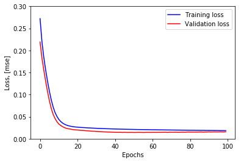


```python
# Use model and compute mean absolute error
X_pred = model.predict(np.array(X_train))
X_pred = pd.DataFrame(X_pred, 
                      columns=X_train.columns)
X_pred.index = X_train.index

scored = pd.DataFrame(index=X_train.index)
scored['Loss_mae'] = np.mean(np.abs(X_pred-X_train), axis = 1)
```


```python
sns.distplot(scored['Loss_mae'],
             bins = 10, 
             kde= True,
            color = 'blue')

mae = scored['Loss_mae']
```

    C:\Users\NOTEBOOK\Miniconda3\lib\site-packages\scipy\stats\stats.py:1713: FutureWarning: Using a non-tuple sequence for multidimensional indexing is deprecated; use `arr[tuple(seq)]` instead of `arr[seq]`. In the future this will be interpreted as an array index, `arr[np.array(seq)]`, which will result either in an error or a different result.
      return np.add.reduce(sorted[indexer] * weights, axis=axis) / sumval
    


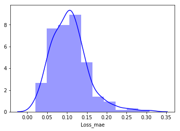


```python
# Compute prediction on test set
X_pred = model.predict(np.array(X_test))
X_pred = pd.DataFrame(X_pred, 
                      columns=X_test.columns)
X_pred.index = X_test.index

scored = pd.DataFrame(index=X_test.index)
scored['Loss_mae'] = np.mean(np.abs(X_pred-X_test), axis = 1)
scored['Threshold'] = get_threshold(mae, 5)
scored['Anomaly'] = scored['Loss_mae'] > scored['Threshold']
scored.plot(logy=True,  figsize = (10,6), ylim = [1e-2,1e2], color = ['blue','red'])
```


    <matplotlib.axes._subplots.AxesSubplot at 0x2013df0a710>


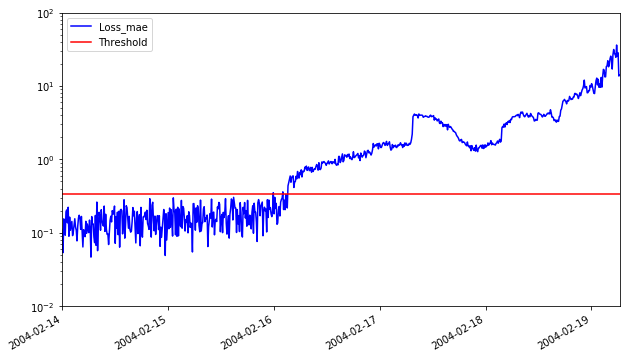


```python
scored.to_csv('Autoencoder_mae.csv')
scored[300:310]
```


<div>
<style scoped>
    .dataframe tbody tr th:only-of-type {
        vertical-align: middle;
    }

    .dataframe tbody tr th {
        vertical-align: top;
    }

    .dataframe thead th {
        text-align: right;
    }
</style>
<table border="1" class="dataframe">
  <thead>
    <tr style="text-align: right;">
      <th></th>
      <th>Loss_mae</th>
      <th>Threshold</th>
      <th>Anomaly</th>
    </tr>
  </thead>
  <tbody>
    <tr>
      <th>2004-02-16 01:52:39</th>
      <td>0.297142</td>
      <td>0.336716</td>
      <td>False</td>
    </tr>
    <tr>
      <th>2004-02-16 02:02:39</th>
      <td>0.361480</td>
      <td>0.336716</td>
      <td>True</td>
    </tr>
    <tr>
      <th>2004-02-16 02:12:39</th>
      <td>0.207377</td>
      <td>0.336716</td>
      <td>False</td>
    </tr>
    <tr>
      <th>2004-02-16 02:22:39</th>
      <td>0.278871</td>
      <td>0.336716</td>
      <td>False</td>
    </tr>
    <tr>
      <th>2004-02-16 02:32:39</th>
      <td>0.206351</td>
      <td>0.336716</td>
      <td>False</td>
    </tr>
    <tr>
      <th>2004-02-16 02:42:39</th>
      <td>0.332187</td>
      <td>0.336716</td>
      <td>False</td>
    </tr>
    <tr>
      <th>2004-02-16 02:52:39</th>
      <td>0.295329</td>
      <td>0.336716</td>
      <td>False</td>
    </tr>
    <tr>
      <th>2004-02-16 03:02:39</th>
      <td>0.217963</td>
      <td>0.336716</td>
      <td>False</td>
    </tr>
    <tr>
      <th>2004-02-16 03:12:39</th>
      <td>0.435979</td>
      <td>0.336716</td>
      <td>True</td>
    </tr>
    <tr>
      <th>2004-02-16 03:22:39</th>
      <td>0.484838</td>
      <td>0.336716</td>
      <td>True</td>
    </tr>
  </tbody>
</table>
</div>


### Flovik's model


```python
# Build Flovik's model
model = Sequential()

# Model is 4 -> 10 -> 2 -> 10 -> 4
model.add(Dense(10, input_dim=4, activation = 'elu', kernel_initializer='glorot_uniform'))
model.add(Dense(2, activation = 'elu', kernel_initializer='glorot_uniform'))
model.add(Dense(10, activation = 'elu', kernel_initializer='glorot_uniform'))
model.add(Dense(4, activation = 'elu', kernel_initializer='glorot_uniform'))

model.compile(optimizer='adam',
              loss='mean_squared_error')
```


```python
# Fit model
history=model.fit(np.array(X_train),np.array(X_train),
                  batch_size=BATCH_SIZE, 
                  epochs=NUM_EPOCHS,
                  validation_split=0.05,
                  verbose = 1)
```

    Train on 210 samples, validate on 12 samples
    Epoch 1/100
    210/210 [==============================] - 0s 2ms/step - loss: 0.1001 - val_loss: 0.0353
    Epoch 2/100
    210/210 [==============================] - 0s 224us/step - loss: 0.0421 - val_loss: 0.0202
    Epoch 3/100
    210/210 [==============================] - 0s 182us/step - loss: 0.0241 - val_loss: 0.0255
    Epoch 4/100
    210/210 [==============================] - 0s 198us/step - loss: 0.0219 - val_loss: 0.0264
    Epoch 5/100
    210/210 [==============================] - 0s 143us/step - loss: 0.0212 - val_loss: 0.0247
    Epoch 6/100
    210/210 [==============================] - 0s 190us/step - loss: 0.0205 - val_loss: 0.0247
    Epoch 7/100
    210/210 [==============================] - 0s 239us/step - loss: 0.0199 - val_loss: 0.0239
    Epoch 8/100
    210/210 [==============================] - 0s 191us/step - loss: 0.0192 - val_loss: 0.0239
    Epoch 9/100
    210/210 [==============================] - 0s 188us/step - loss: 0.0187 - val_loss: 0.0230
    Epoch 10/100
    210/210 [==============================] - 0s 237us/step - loss: 0.0181 - val_loss: 0.0231
    Epoch 11/100
    210/210 [==============================] - 0s 192us/step - loss: 0.0176 - val_loss: 0.0221
    Epoch 12/100
    210/210 [==============================] - 0s 191us/step - loss: 0.0173 - val_loss: 0.0218
    Epoch 13/100
    210/210 [==============================] - 0s 239us/step - loss: 0.0171 - val_loss: 0.0215
    Epoch 14/100
    210/210 [==============================] - 0s 141us/step - loss: 0.0168 - val_loss: 0.0217
    Epoch 15/100
    210/210 [==============================] - 0s 239us/step - loss: 0.0167 - val_loss: 0.0205
    Epoch 16/100
    210/210 [==============================] - 0s 190us/step - loss: 0.0165 - val_loss: 0.0210
    Epoch 17/100
    210/210 [==============================] - 0s 185us/step - loss: 0.0163 - val_loss: 0.0204
    Epoch 18/100
    210/210 [==============================] - 0s 195us/step - loss: 0.0163 - val_loss: 0.0203
    Epoch 19/100
    210/210 [==============================] - 0s 232us/step - loss: 0.0161 - val_loss: 0.0202
    Epoch 20/100
    210/210 [==============================] - 0s 195us/step - loss: 0.0160 - val_loss: 0.0196
    Epoch 21/100
    210/210 [==============================] - 0s 191us/step - loss: 0.0159 - val_loss: 0.0193
    Epoch 22/100
    210/210 [==============================] - 0s 190us/step - loss: 0.0160 - val_loss: 0.0196
    Epoch 23/100
    210/210 [==============================] - 0s 190us/step - loss: 0.0157 - val_loss: 0.0191
    Epoch 24/100
    210/210 [==============================] - 0s 139us/step - loss: 0.0157 - val_loss: 0.0182
    Epoch 25/100
    210/210 [==============================] - 0s 190us/step - loss: 0.0155 - val_loss: 0.0183
    Epoch 26/100
    210/210 [==============================] - 0s 191us/step - loss: 0.0154 - val_loss: 0.0174
    Epoch 27/100
    210/210 [==============================] - 0s 143us/step - loss: 0.0154 - val_loss: 0.0173
    Epoch 28/100
    210/210 [==============================] - 0s 240us/step - loss: 0.0151 - val_loss: 0.0171
    Epoch 29/100
    210/210 [==============================] - 0s 238us/step - loss: 0.0151 - val_loss: 0.0164
    Epoch 30/100
    210/210 [==============================] - 0s 191us/step - loss: 0.0149 - val_loss: 0.0159
    Epoch 31/100
    210/210 [==============================] - 0s 190us/step - loss: 0.0147 - val_loss: 0.0153
    Epoch 32/100
    210/210 [==============================] - 0s 238us/step - loss: 0.0145 - val_loss: 0.0147
    Epoch 33/100
    210/210 [==============================] - 0s 192us/step - loss: 0.0143 - val_loss: 0.0144
    Epoch 34/100
    210/210 [==============================] - 0s 189us/step - loss: 0.0142 - val_loss: 0.0136
    Epoch 35/100
    210/210 [==============================] - 0s 240us/step - loss: 0.0139 - val_loss: 0.0133
    Epoch 36/100
    210/210 [==============================] - 0s 141us/step - loss: 0.0137 - val_loss: 0.0121
    Epoch 37/100
    210/210 [==============================] - 0s 238us/step - loss: 0.0135 - val_loss: 0.0117
    Epoch 38/100
    210/210 [==============================] - 0s 213us/step - loss: 0.0132 - val_loss: 0.0115
    Epoch 39/100
    210/210 [==============================] - 0s 190us/step - loss: 0.0132 - val_loss: 0.0112
    Epoch 40/100
    210/210 [==============================] - 0s 193us/step - loss: 0.0129 - val_loss: 0.0109
    Epoch 41/100
    210/210 [==============================] - 0s 236us/step - loss: 0.0127 - val_loss: 0.0105
    Epoch 42/100
    210/210 [==============================] - 0s 190us/step - loss: 0.0126 - val_loss: 0.0104
    Epoch 43/100
    210/210 [==============================] - 0s 192us/step - loss: 0.0125 - val_loss: 0.0105
    Epoch 44/100
    210/210 [==============================] - 0s 188us/step - loss: 0.0124 - val_loss: 0.0103
    Epoch 45/100
    210/210 [==============================] - 0s 220us/step - loss: 0.0122 - val_loss: 0.0109
    Epoch 46/100
    210/210 [==============================] - 0s 190us/step - loss: 0.0122 - val_loss: 0.0105
    Epoch 47/100
    210/210 [==============================] - 0s 195us/step - loss: 0.0122 - val_loss: 0.0101
    Epoch 48/100
    210/210 [==============================] - 0s 235us/step - loss: 0.0121 - val_loss: 0.0111
    Epoch 49/100
    210/210 [==============================] - 0s 194us/step - loss: 0.0121 - val_loss: 0.0106
    Epoch 50/100
    210/210 [==============================] - 0s 187us/step - loss: 0.0121 - val_loss: 0.0108
    Epoch 51/100
    210/210 [==============================] - 0s 190us/step - loss: 0.0120 - val_loss: 0.0109
    Epoch 52/100
    210/210 [==============================] - 0s 191us/step - loss: 0.0120 - val_loss: 0.0110
    Epoch 53/100
    210/210 [==============================] - 0s 238us/step - loss: 0.0120 - val_loss: 0.0111
    Epoch 54/100
    210/210 [==============================] - 0s 205us/step - loss: 0.0119 - val_loss: 0.0110
    Epoch 55/100
    210/210 [==============================] - 0s 286us/step - loss: 0.0120 - val_loss: 0.0111
    Epoch 56/100
    210/210 [==============================] - 0s 237us/step - loss: 0.0119 - val_loss: 0.0112
    Epoch 57/100
    210/210 [==============================] - 0s 192us/step - loss: 0.0119 - val_loss: 0.0113
    Epoch 58/100
    210/210 [==============================] - 0s 238us/step - loss: 0.0120 - val_loss: 0.0118
    Epoch 59/100
    210/210 [==============================] - 0s 142us/step - loss: 0.0118 - val_loss: 0.0115
    Epoch 60/100
    210/210 [==============================] - 0s 190us/step - loss: 0.0119 - val_loss: 0.0111
    Epoch 61/100
    210/210 [==============================] - 0s 181us/step - loss: 0.0119 - val_loss: 0.0114
    Epoch 62/100
    210/210 [==============================] - 0s 144us/step - loss: 0.0118 - val_loss: 0.0110
    Epoch 63/100
    210/210 [==============================] - 0s 141us/step - loss: 0.0118 - val_loss: 0.0111
    Epoch 64/100
    210/210 [==============================] - 0s 192us/step - loss: 0.0119 - val_loss: 0.0126
    Epoch 65/100
    210/210 [==============================] - 0s 191us/step - loss: 0.0117 - val_loss: 0.0108
    Epoch 66/100
    210/210 [==============================] - 0s 284us/step - loss: 0.0118 - val_loss: 0.0117
    Epoch 67/100
    210/210 [==============================] - 0s 247us/step - loss: 0.0117 - val_loss: 0.0117
    Epoch 68/100
    210/210 [==============================] - 0s 182us/step - loss: 0.0117 - val_loss: 0.0111
    Epoch 69/100
    210/210 [==============================] - 0s 190us/step - loss: 0.0117 - val_loss: 0.0116
    Epoch 70/100
    210/210 [==============================] - 0s 192us/step - loss: 0.0116 - val_loss: 0.0121
    Epoch 71/100
    210/210 [==============================] - 0s 190us/step - loss: 0.0116 - val_loss: 0.0113
    Epoch 72/100
    210/210 [==============================] - 0s 188us/step - loss: 0.0116 - val_loss: 0.0122
    Epoch 73/100
    210/210 [==============================] - 0s 337us/step - loss: 0.0116 - val_loss: 0.0121
    Epoch 74/100
    210/210 [==============================] - 0s 218us/step - loss: 0.0116 - val_loss: 0.0114
    Epoch 75/100
    210/210 [==============================] - 0s 189us/step - loss: 0.0115 - val_loss: 0.0123
    Epoch 76/100
    210/210 [==============================] - 0s 238us/step - loss: 0.0115 - val_loss: 0.0117
    Epoch 77/100
    210/210 [==============================] - 0s 142us/step - loss: 0.0115 - val_loss: 0.0117
    Epoch 78/100
    210/210 [==============================] - 0s 191us/step - loss: 0.0114 - val_loss: 0.0113
    Epoch 79/100
    210/210 [==============================] - 0s 191us/step - loss: 0.0114 - val_loss: 0.0121
    Epoch 80/100
    210/210 [==============================] - 0s 190us/step - loss: 0.0114 - val_loss: 0.0118
    Epoch 81/100
    210/210 [==============================] - 0s 206us/step - loss: 0.0113 - val_loss: 0.0121
    Epoch 82/100
    210/210 [==============================] - 0s 224us/step - loss: 0.0113 - val_loss: 0.0126
    Epoch 83/100
    210/210 [==============================] - 0s 236us/step - loss: 0.0113 - val_loss: 0.0119
    Epoch 84/100
    210/210 [==============================] - 0s 145us/step - loss: 0.0113 - val_loss: 0.0124
    Epoch 85/100
    210/210 [==============================] - 0s 190us/step - loss: 0.0113 - val_loss: 0.0119
    Epoch 86/100
    210/210 [==============================] - 0s 238us/step - loss: 0.0113 - val_loss: 0.0122
    Epoch 87/100
    210/210 [==============================] - 0s 143us/step - loss: 0.0112 - val_loss: 0.0133
    Epoch 88/100
    210/210 [==============================] - 0s 186us/step - loss: 0.0112 - val_loss: 0.0120
    Epoch 89/100
    210/210 [==============================] - 0s 193us/step - loss: 0.0111 - val_loss: 0.0123
    Epoch 90/100
    210/210 [==============================] - 0s 143us/step - loss: 0.0111 - val_loss: 0.0124
    Epoch 91/100
    210/210 [==============================] - 0s 191us/step - loss: 0.0111 - val_loss: 0.0127
    Epoch 92/100
    210/210 [==============================] - 0s 190us/step - loss: 0.0111 - val_loss: 0.0115
    Epoch 93/100
    210/210 [==============================] - 0s 188us/step - loss: 0.0111 - val_loss: 0.0130
    Epoch 94/100
    210/210 [==============================] - 0s 243us/step - loss: 0.0110 - val_loss: 0.0124
    Epoch 95/100
    210/210 [==============================] - 0s 233us/step - loss: 0.0110 - val_loss: 0.0120
    Epoch 96/100
    210/210 [==============================] - 0s 147us/step - loss: 0.0110 - val_loss: 0.0125
    Epoch 97/100
    210/210 [==============================] - 0s 192us/step - loss: 0.0109 - val_loss: 0.0127
    Epoch 98/100
    210/210 [==============================] - 0s 190us/step - loss: 0.0108 - val_loss: 0.0130
    Epoch 99/100
    210/210 [==============================] - 0s 190us/step - loss: 0.0108 - val_loss: 0.0128
    Epoch 100/100
    210/210 [==============================] - 0s 161us/step - loss: 0.0108 - val_loss: 0.0125
    


```python
plt.plot(history.history['loss'],
         'b',
         label='Training loss')
plt.plot(history.history['val_loss'],
         'r',
         label='Validation loss')
plt.legend(loc='upper right')
plt.xlabel('Epochs')
plt.ylabel('Loss, [mse]')
plt.ylim([0,.1])
plt.show()
```


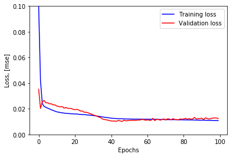


```python
# Use model and compute mean absolute error
X_pred = model.predict(np.array(X_train))
X_pred = pd.DataFrame(X_pred, 
                      columns=X_train.columns)
X_pred.index = X_train.index

scored = pd.DataFrame(index=X_train.index)
scored['Loss_mae'] = np.mean(np.abs(X_pred-X_train), axis = 1)
```


```python
sns.distplot(scored['Loss_mae'],
             bins = 10, 
             kde= True,
            color = 'blue')

mae = scored['Loss_mae']
```

    C:\Users\NOTEBOOK\Miniconda3\lib\site-packages\scipy\stats\stats.py:1713: FutureWarning: Using a non-tuple sequence for multidimensional indexing is deprecated; use `arr[tuple(seq)]` instead of `arr[seq]`. In the future this will be interpreted as an array index, `arr[np.array(seq)]`, which will result either in an error or a different result.
      return np.add.reduce(sorted[indexer] * weights, axis=axis) / sumval
    


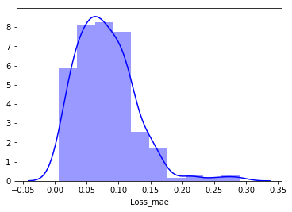


```python
# Compute prediction on test set
X_pred = model.predict(np.array(X_test))
X_pred = pd.DataFrame(X_pred, 
                      columns=X_test.columns)
X_pred.index = X_test.index

scored = pd.DataFrame(index=X_test.index)
scored['Loss_mae'] = np.mean(np.abs(X_pred-X_test), axis = 1)
scored['Threshold'] = get_threshold(mae, 5)
scored['Anomaly'] = scored['Loss_mae'] > scored['Threshold']
scored.plot(logy=True,  figsize = (10,6), ylim = [1e-2,1e2], color = ['blue','red'])
```


    <matplotlib.axes._subplots.AxesSubplot at 0x2013f725d68>


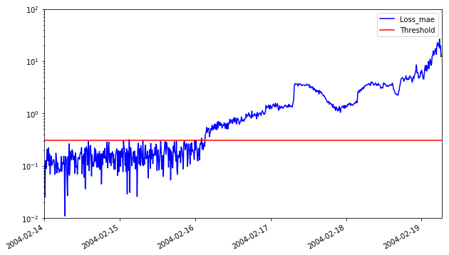


```python
scored.to_csv('Flovik_Autoencoder_mae.csv')
scored[300:310]
```


<div>
<style scoped>
    .dataframe tbody tr th:only-of-type {
        vertical-align: middle;
    }

    .dataframe tbody tr th {
        vertical-align: top;
    }

    .dataframe thead th {
        text-align: right;
    }
</style>
<table border="1" class="dataframe">
  <thead>
    <tr style="text-align: right;">
      <th></th>
      <th>Loss_mae</th>
      <th>Threshold</th>
      <th>Anomaly</th>
    </tr>
  </thead>
  <tbody>
    <tr>
      <th>2004-02-16 01:52:39</th>
      <td>0.282433</td>
      <td>0.31107</td>
      <td>False</td>
    </tr>
    <tr>
      <th>2004-02-16 02:02:39</th>
      <td>0.337438</td>
      <td>0.31107</td>
      <td>True</td>
    </tr>
    <tr>
      <th>2004-02-16 02:12:39</th>
      <td>0.209569</td>
      <td>0.31107</td>
      <td>False</td>
    </tr>
    <tr>
      <th>2004-02-16 02:22:39</th>
      <td>0.271575</td>
      <td>0.31107</td>
      <td>False</td>
    </tr>
    <tr>
      <th>2004-02-16 02:32:39</th>
      <td>0.203127</td>
      <td>0.31107</td>
      <td>False</td>
    </tr>
    <tr>
      <th>2004-02-16 02:42:39</th>
      <td>0.238310</td>
      <td>0.31107</td>
      <td>False</td>
    </tr>
    <tr>
      <th>2004-02-16 02:52:39</th>
      <td>0.274928</td>
      <td>0.31107</td>
      <td>False</td>
    </tr>
    <tr>
      <th>2004-02-16 03:02:39</th>
      <td>0.235273</td>
      <td>0.31107</td>
      <td>False</td>
    </tr>
    <tr>
      <th>2004-02-16 03:12:39</th>
      <td>0.389154</td>
      <td>0.31107</td>
      <td>True</td>
    </tr>
    <tr>
      <th>2004-02-16 03:22:39</th>
      <td>0.420112</td>
      <td>0.31107</td>
      <td>True</td>
    </tr>
  </tbody>
</table>
</div>


Both models gives equivalent results. However loss function of the 10 neurons model is closer to zero has would be expected from a more complex model.

## Single Class SVM


```python
#Ongoing
```

## Wavelets trial


```python
import pywt

# discrete wavelet transform
data = pd.read_csv(join(getcwd(), '2nd_test', '2nd_test', files[0]), sep = "\t",
                         names = ['Bearing1', "Bearing2", "Bearing3", "Bearing4"])
cA, cD = pywt.dwt(data["Bearing1"], 'sym6')
```


```python
sns.distplot(cA)
```

    C:\Users\NOTEBOOK\Miniconda3\lib\site-packages\scipy\stats\stats.py:1713: FutureWarning: Using a non-tuple sequence for multidimensional indexing is deprecated; use `arr[tuple(seq)]` instead of `arr[seq]`. In the future this will be interpreted as an array index, `arr[np.array(seq)]`, which will result either in an error or a different result.
      return np.add.reduce(sorted[indexer] * weights, axis=axis) / sumval
    


    <matplotlib.axes._subplots.AxesSubplot at 0x2013fa02160>


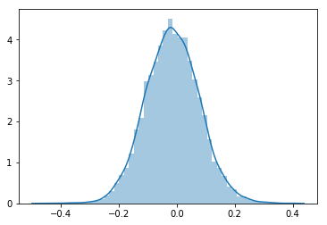


```python
sns.distplot(cD)
```

    C:\Users\NOTEBOOK\Miniconda3\lib\site-packages\scipy\stats\stats.py:1713: FutureWarning: Using a non-tuple sequence for multidimensional indexing is deprecated; use `arr[tuple(seq)]` instead of `arr[seq]`. In the future this will be interpreted as an array index, `arr[np.array(seq)]`, which will result either in an error or a different result.
      return np.add.reduce(sorted[indexer] * weights, axis=axis) / sumval
    


    <matplotlib.axes._subplots.AxesSubplot at 0x2013fab3400>


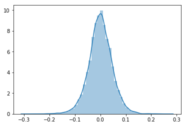

